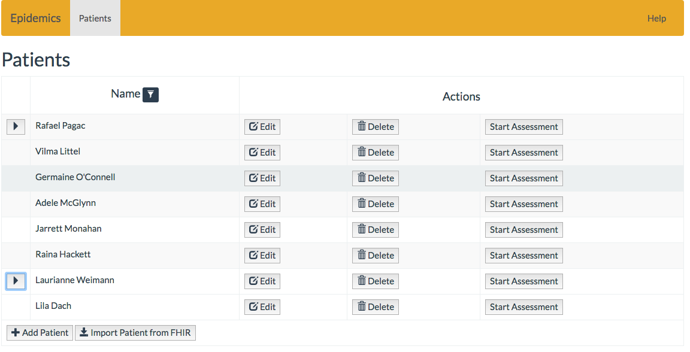
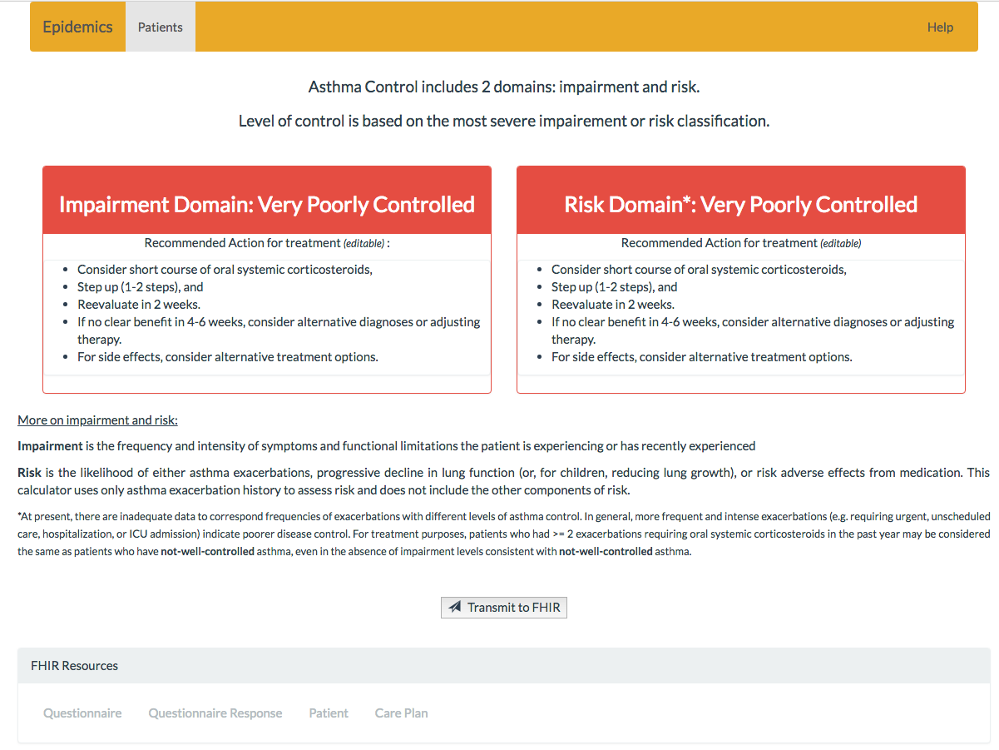
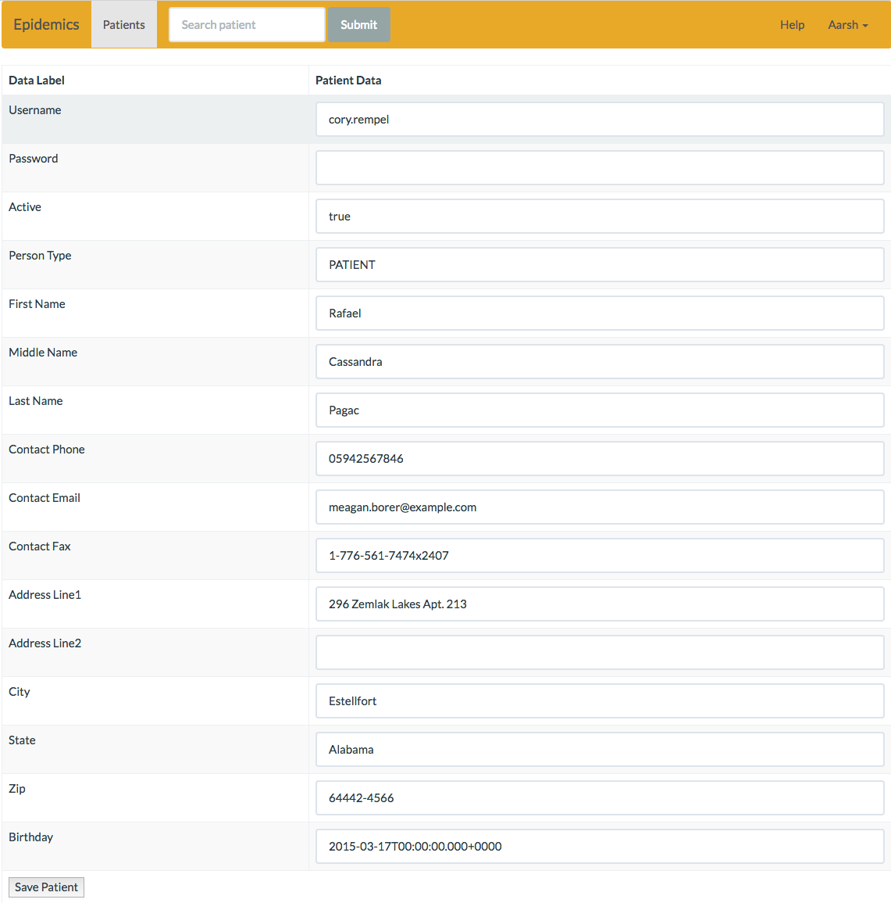
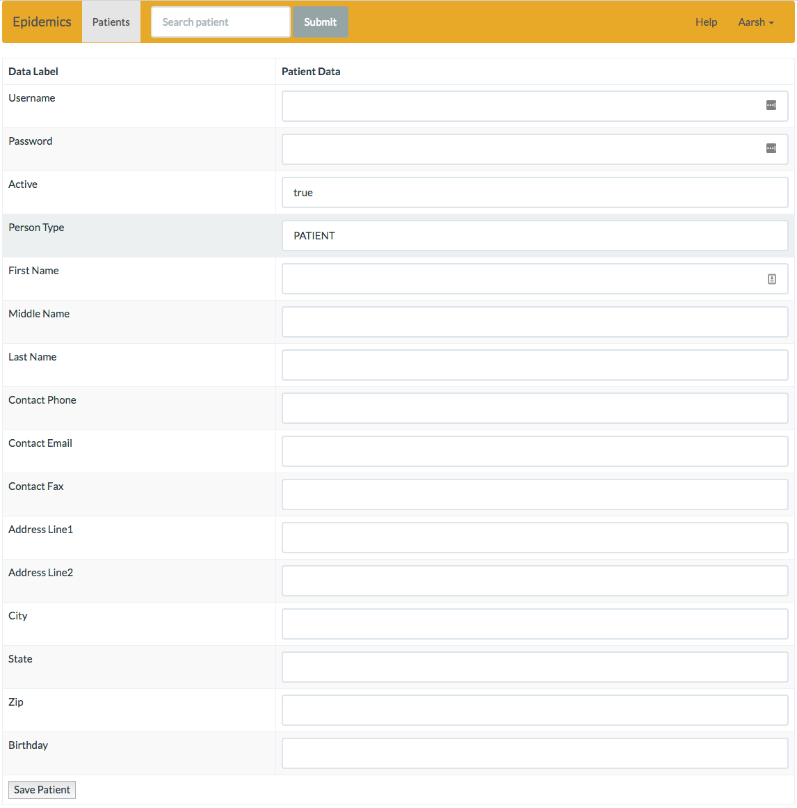
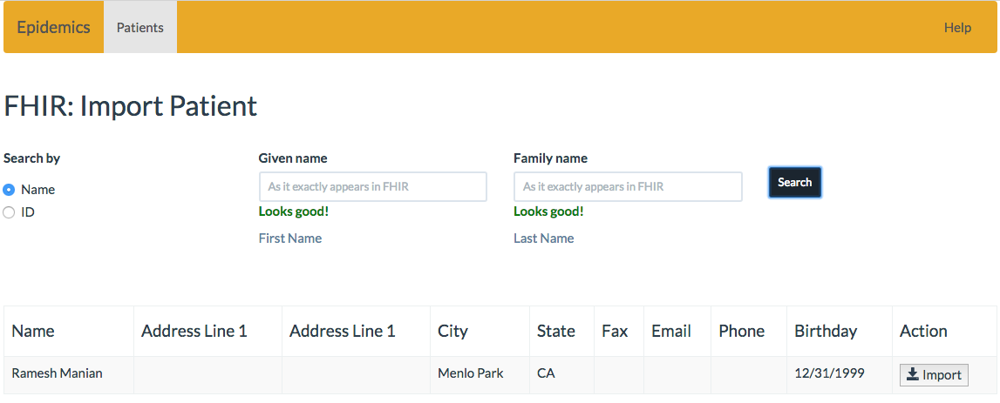

# Asthma Control - User Guide
>CDC, 
>Georgia Tech, 
>Team Epidemics

### Team Members
* Aarsh Talati
* Ramesh Ramasubramanian
* Matthew Hull
* Charity Leschinski
* Eric Leschinski
* Scott Greiner

### Github link
https://github.gatech.edu/gt-hit-spring2018/Asthma-Control

## Table of Contents

* [Overview](User_Guide.md#overview)
* [Epidemics Application](User_Guide.md#epidemics-application)
  * [Introduction](User_Guide.md#introduction)
  * [Setup and running](User_Guide.md#setup-and-running)
  * [Select a patient](User_Guide.md#select-a-patient)
  * [Asthma control questionnaire](User_Guide.md#asthma-control-questionnaire)
  * [Asthma control assessment](User_Guide.md#asthma-control-assessment)
  * [Treatment plan](User_Guide.md#treatment-plan)
  * [Post-Submission](User_Guide.md#post-Submission)
  * [Navigation Bar](User_Guide.md#navigation-bar)
  
# Overview

Asthma guidelines suggest having a patient's asthma control evaluated regularly. This application is a working prototype used to ask patients a series of questions appropriate to their age group, evaluate their current control of their asthma across the domains of risk and impairment, and provide recommended action steps for treatment based on EPR-3 asthma guidelines. This information is then stored to a FHIR server.  

# Epidemics Application

## Introduction
Epidemics is a web application. It is typically run at a care provider's office and would be integrated with an EHR (Electronic Health Record) application. The provider would select the patient and work with the patient to answer a set of relevant questions and submit the responses to a computer server which would analyze and present to the provider treatment recommendations, which can be modified by the provider. The application is designed to be highly interoperable with the use of Fast Interoperability Health Resources (FHIR) standards. 

## Setup and running
Epidemics application runs locally with the default configuration. For installation and software packages needed for running Epidemics, please *see installation manual*. Once installed and configured, the application is launched by navigating to http://localhost:8081. When you have successfuly installed and configured the application, the home page should look like the image below.

## Select a patient
The end user (a clinician, with a patient) is presented with the list of patients from which they can select one for whom the assessment will be performed. Selecting the *"Start Assessment"* icon in the row of the desired patient will launch the questionnaire. 
>The questionnaire launched depends on the age of the selected patient as of the day that the questionnaire is being taken. Patients are grouped to either 0-4, 5-11, or 12+ years of age in accordance with the EPR-3 guidelines. Each age group receives different questions in their questionnaire.

Clicking the filter icon will allow the end user to begin searching by patient name. Clicking it again will close the filter.

The patient list page also contains controls for [editing patient](User_Guide.md#edit-patient-details) details,  [adding new patients](User_Guide.md#adding-patient) and [importing patients](User_Guide.md#Import-patient-from-FHIR).

On this page the end user can view historical visit information by clicking the drop down arrow next to the patient's name, if present, and clicking *"Details"* on the visit they would like to review.

Prior to startingthe assessment of the aptient, the caregiver can review the patient's prior visit details if available, by clicking the drop down arrow to the left of patient's name. A sample image of what the user would see is below.

## Asthma control questionnaire
The end user will be presented with questions about the patient's control of asthma one question at a time. Each question must be answered to proceed. The user selects a question by clicking anywhere in the button associated with that answer, and upon clicking the button for the selected answer will change color. 
>To change an answer, the end user clicks on a button for another answer to select that answer. Once an answer has been selected, the "Next" button will become enabled, allowing the user to proceed to the next question in the questionnaire. 

A sample image of a question for a child patient will look like the image below.

At  any time during the question-answering portion, if the user wants to return to a previously answered question and adjust their answer they can press the "Previous" button. The answer they previously selected will remain highlighted, and they can change answers, as before, by selecting the button of another answer.

On the final question the "Next" button is replaced with a  "Submit" button, to end the portion of the questionnaire consisting of questions for the end user. When this button is pressed, the application will calculate the levels of asthma control in accordance with the EPR-3 guidelines and return this information to the patient.

## Asthma control assessment
The application uses the patient's responses to each of the questions to calculate asthma control in the **Risk** and **Impairment** domains according to the EPR-3 guidelines for the patient's age group. Each domain's control level is calculated independently.

## Treatment plan
After the user submits the questions and these control levels are calculated they are displayed to the end user along with **Recommended Actions for Treatment**, also provided by EPR-3 guidelines. Each domain receives recommended actions for treatment.

The result of the analysis and treatment plan recommendation are seen in the sample image below.

"Well Controlled" is presented to the user in a green panel, "Not Well Controlled" is presented in yellow, and "Very Poorly Controlled" is presented in red.

These **Actions** are presented as editable to the end user. This allows for the clinician to customize the action steps for an individual patient (e.g., add patient-specific context for clarity or add or remove action steps) if desirable. To edit, click into the panel and begin typing. 

## Saving externally
When the end user is ready to save the asthma control levels they press the *Transmit to FHIR* button to save information from this questionnaire.

The end user will transmit the questionnaire (if it doesn't already exist) and responses to the questionnaire, patient information, and asthma control levels and actions for treatment to FHIR by clicking the *Transmit to FHIR* button.

If data has been stored to FHIR, a section at the bottom of the Results page provides options for the end user to retrieve and review the information they've just stored to FHIR. Clicking any of the available links will open a browser tab containing the information returned from FHIR for that FHIR resource. The result of the FHIR transmission are seen in the sample image below.

## Edit patient details
In this screen, a patient's current details are shown. Details can be edited and saved from this page. A sample edit of patient details is shown below.

## Add patient

When "Add Patient" button on the home page is clicked, a blank form is shown whcih can be edited to add details about the patient. This screen can also be used to add a doctor entity as well. Adding doctor entities is not fully functional as it is out of the scope of our project. A sample add of patient details is shown below.

## Import patient from FHIR

Clicking the "Import Patient from FHIR" button will navigate the user to a screen where they can search the FHIR server for the patient they would like to import. This search can be done by name or by FHIR ID. When the patient is found, pressing the "Import" button imports the patient to the local database (see image below)

and brings the end user to the [edit patient screen](User_Guide.md#edit-patient-details), in case they need to update any information for this patient. Clicking the "Save Patient" button returns the end user to the home page.

# Navigation Bar 

In addition to the information held on each page specific to that page, each page contains a common navigation bar across the top of the page with clickable links. This navigation bar is the same across all pages of the application.

- Patient
	- This link redirects to the home page, where a user can select a patient
-	Help
	-	This page links to a small page offering guidance, a subset of this user guide. 	
