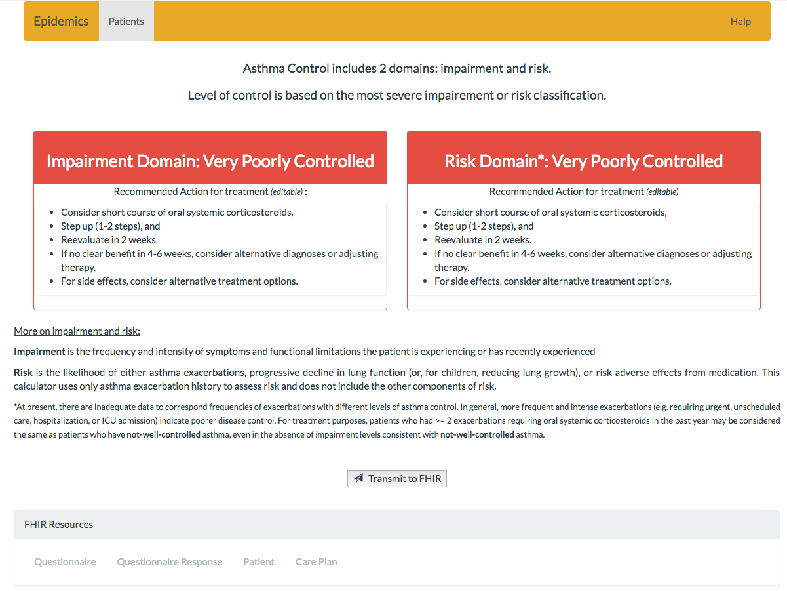

# Asthma Control - User Guide
>CDC, 
>Georgia Tech, 
>Team Epidemics
**Still need to add screenshots**

## Table of Contents

* [Overview](User_Guide.md#overview)
* [Epidemics Application](User_Guide.md#epidemics-application)
  * [Introduction](User_Guide.md#introduction)
  * [Setup and running](User_Guide.md#setup-and-running)
  * [Select a patient](User_Guide.md#select-a-patient)
  * [Asthma control questionnaire](User_Guide.md#asthma-control-questionnaire)
  * [Asthma control assessment](User_Guide.md#asthma-control-assessment)
  * [Treatment plan](User_Guide.md#treatment-plan)
  * [FHIR integration](User_Guide.md#fhir-integration)
  * [Post-Submission](User_Guide.md#post-Submission)
  * [Navigation Bar](User_Guide.md#navigation-bar)

# Overview

Asthma guidelines suggest having a patient's asthma control evaluated regularly. This application is a working prototype used to ask patients a series of questions appropriate to their age group, evaluate their current control of their asthma across the domains of risk and impairment, and provide recommended action steps for treatment based on EPR-3 asthma guidelines. This information is then stored to a FHIR server.  

# Epidemics Application

## Introduction
Epidemics is a web application. It is typically run at a care provider's office and would be integrated with an EHR (Electronic Health Record) application. The provider would select the patient and work with the patient to answer a set of relevant questions and submit the responses to a computer server whichwould analyze and present to the provider treatment recommendations, which can be modified by the provider. The application is designed to be highly interoperable with the use of Fast Interoperability Health Resources (FHIR) standards. 

## Setup and running
Epidemics application runs locally with the default configuration. For installation and software packages needed for running Epidemics, please *see installation manual*. Once installed and configured, the application is launched by navigating to http://localhost:8081. When you have successfuly installed and configured the application, the home page should look like the image below.

## Select a patient
The end user (a clinician, with a patient) is presented with the list of patients from which they can select one for whom the assessment will be performed. Selecting the *"play"* icon in the row of the desired patient will launch the questionnaire. 
>The questionnaire launched depends on the age of the selected patient as of the day that the questionnaire is being taken. Patients are grouped to either 0-4, 5-11, or 12+ years of age in accordance with the EPR-3 guidelines. Each age group receives different questions in their questionnaire.

The patient list page also contains controls for [editing patient](User_Guide.md#edit-patient-details) details and [adding new patients](User_Guide.md#adding-patient).

## Asthma control questionnaire
The end user will be presented with questions about the patient's control of asthma one question at a time. Each question must be answered to proceed. The user selects a question by clicking anywhere in the button associated with that answer, and upon clicking the button for the selected answer will change color. 
>To change an answer, the end user clicks on a button for another answer to select that answer. Once an answer has been selected, the "Next" button will become enabled, allowing the user to proceed to the next question in the questionnaire. 

A sample image of a question for a child patient will look like the image below.

At  any time during the question-answering portion, if the user wants to return to a previously answered question and adjust their answer they can press the "Previous" button. The answer they previously selected will remain highlighted, and they can change answers, as before, by selecting the button of another answer.

On the final question the "Next" button is replaced with a  "Submit" button, to end the portion of the questionnaire consisting of questions for the end user. When this button is pressed, the application will calculate the levels of asthma control in accordance with the EPR-3 guidelines and return this information to the patient.

## Asthma control assessment
The application uses the patient's age and the responses to each of the questions to calculate asthma control in the **Risk** and **Impairment** domains according to the EPR-3 guidelines. Each domain's control level is calculated independently.

## Treatment plan
After the user submits the questions and these control levels are calculated they are displayed to the end user along with **Recommended Actions for Treatment**, also provided by EPR-3 guidelines. Each domain receives recommended actions for treatment.

The result of the analysis and treatment plan recommendation are seen in the sample image below.

These **Actions** are presented as editable to the end user. This allows for the clinician to customize the action steps for an individual patient (e.g., add patient-specific context for clarity or add or remove action steps) if desirable. 

## FHIR integration
When the end user is ready to save the asthma control levels they press the *Transmit to FHIR* button to save these levels to the FHIR server.
>**still under consideration**
The end user can select to save any combination of the questionnaire (if it doesn't exist) and responses to the questionnaire, patient information, and asthma control levels and actions for treatment via check boxes presented on the final page before transmitting data to FHIR

## Post-Submission

**still under consideration**
A configurable option is to show new tabs upon completion of uploading data to FHIR. This mode would not be enabled for end users, but for developers and testing this shows that data has been successfully saved to FHIR. Once data has been stored, for each FHIR resource selected for storage by the end user, a browser tab is opened containing the information returne when querying FHIR for the information stored whent he button is pressed. 

## Edit patient details

## Add patient

# Navigation Bar 

In addition to the information held on each page specific to that page, each page contains a common navigation bar across the top of the page with clickable links. This navigation bar is the same across all pages of the application.

- Patient
	- This link redirects to the home page, where a user can select a patient
-	Help
	-	This page links to a small page offering guidance, a subset of this user guide. 	
- Logout
	- This page will redirect to the home page, where a user can select a patient
